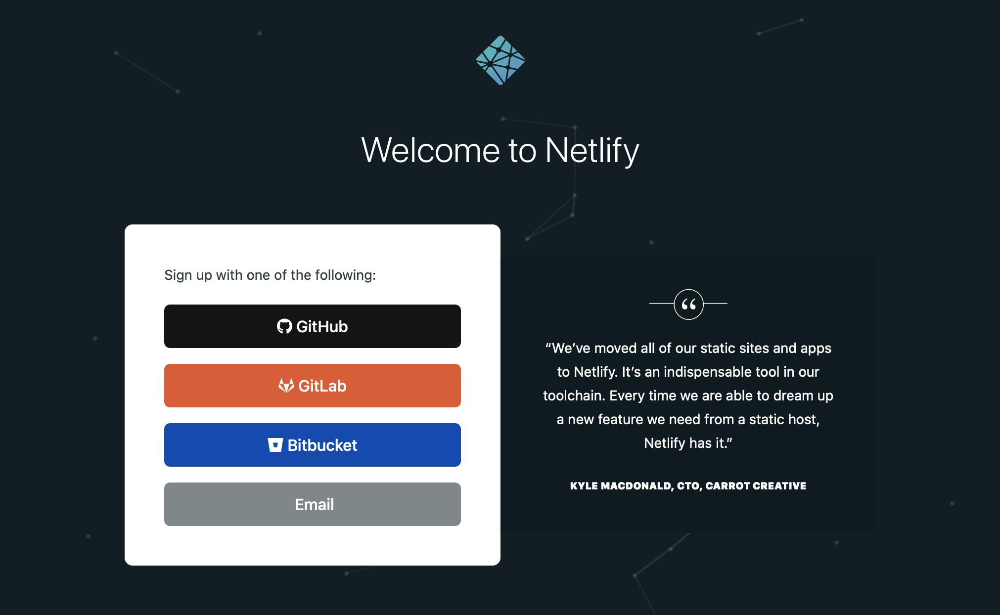

## Set up GitHub

We will be using GitHub in this workshop for version control and publishing. Sign up for a free GitHub.com account at <https://github.com/join> if you don't already have one. Also:

+ Complete these [installation instructions](https://happygitwithr.com/install-intro.html).
    
+ Test your connection between GitHub and RStudio following [these steps](https://happygitwithr.com/connect-intro.html).

+ **NOTE:** We *strongly recommend* that:
    + you choose [HTTPS over SSH](https://happygitwithr.com/credential-caching.html), and
    + you setup a [GitHub Personal Access Token](https://happygitwithr.com/credential-caching.html#get-a-pat).

+ Check your new repository settings. As of [October 1, 2020](https://github.blog/changelog/2020-08-26-set-the-default-branch-for-newly-created-repositories/), GitHub will set `main` as the default branch for all new repositories, instead of `master`. To check this, for user accounts, go to: <https://github.com/settings/repositories>

    You should see something like this:

    

    If yours still says `master`, you may change it to `main` here if you wish.
    
## Sign up for Netlify

Netlify is a platform that offers cloud hosting and serverless backend services for static websites. Lucky for us, that is what we need- we'll be making static websites together! Netlify has a free plan, which we will use in this workshop. Please go ahead and sign up:

1. Go online to [Netlify.com](https://www.netlify.com/).

1. Click on the "Sign Up" button. 

    

1. I recommend signing up using your existing GitHub account (no need to create another account), so select "GitHub" (you may need to sign in), and click to "Authorize Netlify."

    


## Installations

On the days of the workshop, please plan to work from a laptop that has the following installed:

+ A recent version of R (>=3.6.0), which is available for free at https://cloud.r-project.org/
    
+ The most recent version of the RStudio Desktop Integrated Development Environment (IDE version 1.4), available for free ([RStudio Desktop Open Source License](https://www.rstudio.com/products/rstudio/download/#download)). Read up on the latest version [here](https://blog.rstudio.com/2021/01/19/announcing-rstudio-1-4/).
    
+ The blogdown R package, which you can install by connecting to the internet, opening RStudio, and running at the command line:

    ```r
    > install.packages("blogdown")
    ```
    
+ Restart your R session before using any newly installed packages :smile:

## Install Hugo

We'll use the blogdown package to make a Hugo website from the comfort of RStudio. Please go ahead and install Hugo:
 
```r
> blogdown::install_hugo()
```

And ensure your current version is at least as high as:

```r
> blogdown::hugo_version()
[1] ‘0.80.0’
```

## Markdown review

Please complete this [10-minute interactive tutorial on Markdown](https://commonmark.org/help/tutorial/). 
