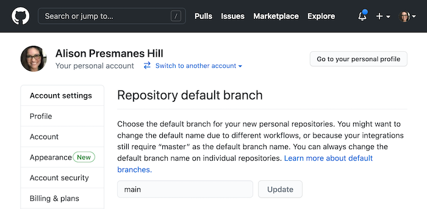
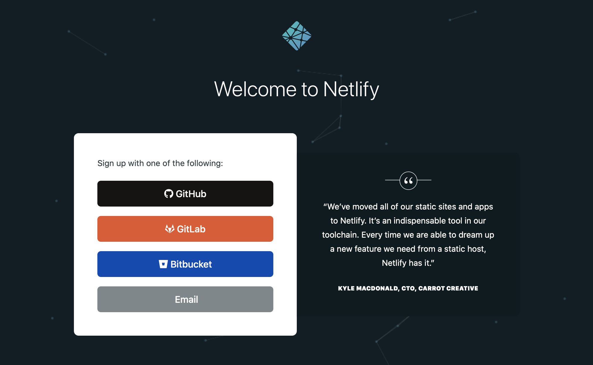

## tl;dr

To start, you'll need the following in place (all are free):

+ Recent versions of R and RStudio installed

    + R: v >= 3.6.0, https://cloud.r-project.org/
    
    + RStudio: v >= 1.4, https://www.rstudio.com/products/rstudio/download/#download
    
+ A free GitHub account (https://github.com/join)

+ A working connection to GitHub from RStudio (see free book: https://happygitwithr.com/)

+ A free Netlify account connected to your GitHub account (https://app.netlify.com/signup)

+ A recent version of the blogdown R package installed.

+ A recent version of Hugo.

To set these up for the first time, read on.

## Install R and RStudio

For a pep talk about getting current on these installations, please read: https://happygitwithr.com/install-r-rstudio.html

+ Install a recent version of R (>=3.6.0), which is available for free at https://cloud.r-project.org/. Check your current version:

    ```r
    R.version.string
    ```
    
+ Install a recent version of the RStudio Desktop Integrated Development Environment (IDE version >= 1.4), available for free ([RStudio Desktop Open Source License](https://www.rstudio.com/products/rstudio/download/#download)). Check your current version:

    ```r
    # install.packages("rstudioapi")
    rstudioapi::getVersion()
    ```


## Create a GitHub account

Sign up for a free GitHub.com account at <https://github.com/join> if you don't already have one. 

Complete these installation instructions:

+ [Install Git](https://happygitwithr.com/install-git.html)

+ [Introduce yourself to Git](https://happygitwithr.com/hello-git.html)

+ [Set up credentials](https://happygitwithr.com/https-pat.html)

+ [Connect to GitHub](https://happygitwithr.com/push-pull-github.html)

+ Check your new repository settings. As of [October 1, 2020](https://github.blog/changelog/2020-08-26-set-the-default-branch-for-newly-created-repositories/), GitHub will set `main` as the default branch for all new repositories, instead of `master`. To check this, for user accounts, go to: <https://github.com/settings/repositories>

    You should see something like this:

    

    If yours still says `master`, you may change it to `main` here if you wish.

Did it all work? Check that this works:

```r
# install.packages("usethis")
usethis::git_sitrep()
```

## Connect RStudio to your GitHub

We assume the following:

+ You have installed/updated R and RStudio.

+ You have a free GitHub account.

+ You have installed Git.

+ You have introduced yourself to Git.

+ You have confirmed that you can push to / pull from GitHub from the command line.

Next, follow these steps to test your connection to GitHub from RStudio:

+ [Connect RStudio to Git and GitHub](https://happygitwithr.com/rstudio-git-github.html)

+ Troubleshooting help:
    + [Detect Git from RStudio](https://happygitwithr.com/rstudio-see-git.html)
    + [More troubleshooting](https://happygitwithr.com/troubleshooting.html)


## Sign up for Netlify

Netlify is a platform that offers cloud hosting and serverless backend services for static websites. Lucky for us, that is what we need- we'll be making a static websites. Netlify has a free plan tier, which in my experience is plenty for personal websites. To sign up:

1. Sign up on <https://app.netlify.com/signup>.

1. Select to sign up using your existing GitHub account (no need to create another account), so select "GitHub" (you may need to sign in), and click to "Authorize Netlify."

    


## Install blogdown

We'll use the blogdown package to make a Hugo website from the comfort of RStudio. Install by connecting to the internet, opening RStudio, and running at the command line:

```r
> install.packages("blogdown")
```
    
Restart your R session before using any newly installed packages :smile:

## Install Hugo

We'll use Hugo to build our site. Use the blogdown package to install Hugo:
 
```r
> blogdown::install_hugo()
```

And ensure your current version is at least as high as:

```r
> blogdown::hugo_version()
[1] ‘0.80.0’
```

## Markdown review

Please complete this [10-minute interactive tutorial on Markdown](https://commonmark.org/help/tutorial/). 

## You made it!

With all this preparation in place, you are ready to [create your site](../create-site)
