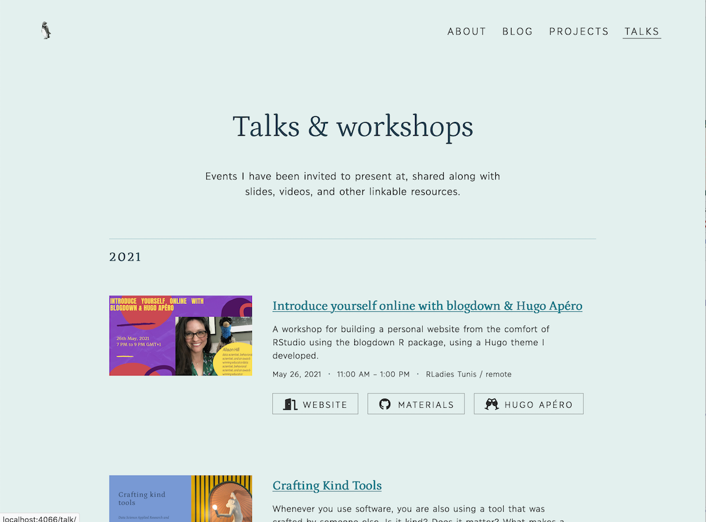
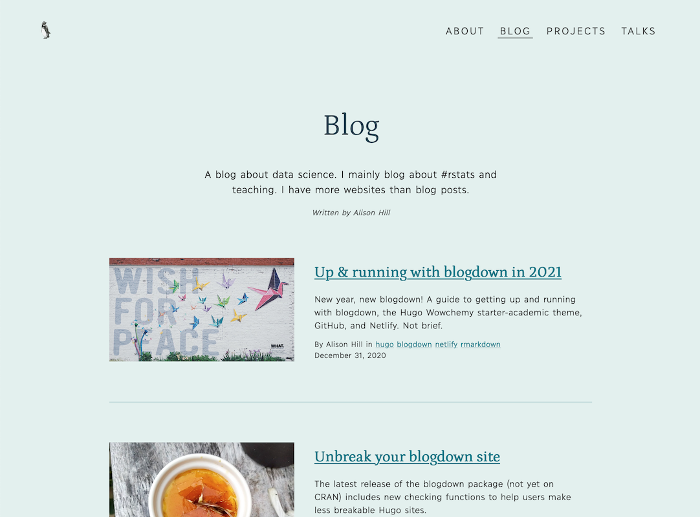

Hugo allows you to use a page's front matter (written in yaml, toml, or json) to keep metadata attached to markdown files. The motto in Hugo is "everything is a page."

There are two sets of front matter for each content section. One set is for the section itself (`/blog/_index.md`), and the other for each page within a section, which consist of front matter plus content (`/blog/my-blog-post/index.md`). Both sections (`/blog/_index.md`) and single pages (`/blog/my-blog-post/index.md`) are markdown files, but the `_index` filename tells you that is a section configuration file. 

Apéro provides unique layouts for three main content sections:

+ blogs (Ex: <https://hugo-apero.netlify.app/blog/>),
+ projects (Ex: <https://hugo-apero.netlify.app/project/>), and
+ talks (Ex: <https://hugo-apero.netlify.app/talk/>).




With a `list-sidebar` layout and thumbnails





With a `list-grid` layout and thumbnails






With a `list` layout and thumbnails







These are easy to see in your content folder structure and the structure of the urls for your site (note the folder names are singular, not plural):

```bash
content/
├── blog/    --> https://mydomain.io/blog/
├── project/ --> https://mydomain.io/project/
└── talk/    --> https://mydomain.io/talk/
```


The following page configuration options are found in the front matter of each content section of a Hugo Apéro site.

To learn more about section page templates, read the [Hugo docs](https://gohugo.io/templates/section-templates/).

## Lists of pages

Section pages are always lists. For most sections, there are three listing `layout` choices: 

+ `list` (blogs, projects, talks)
+ `list-sidebar` (blogs, projects, talks), or 
+ `list-grid` (blogs and projects only).



















We list each section pages with a title and excerpt plus a thumbnail, byline, and dateline according to your boolean choice here.

```yaml
title: A Blog That Works
description: |
  Words
  go
  here.
author: "Alison Hill"
show_post_thumbnail: true
thumbnail_left: true # for list-sidebar only
show_author_byline: true
show_post_date: true
# for listing page layout
layout: list-sidebar # list, list-sidebar, list-grid
```

## Thumbnail images

Any of the list layouts can be used with thumbnails (`show_post_thumbnail: true`) or without thumbnails (`show_post_thumbnail: false`). They all look good, and work well on mobile!

If you show thumbnails, the image file in each page's bundle with the word `featured` in the filename will be used as the page thumbnail in the list (like `featured.jpg` or even `mario-kart-featured.png`). The featured image will also be that page's social sharing image. 

```bash
content/
└── blog
    ├── _index.md
    └── my-blog-post
        ├── my-featured.jpg <- your thumbnail!
        └── index.md
```

If your image happens to be a hex shape (like an R package hex sticker), include the word `hex` in the filename too, like `my-featured-hex.png`.

```bash
content/
└── blog
    ├── _index.md
    └── my-blog-post
        ├── my-featured-hex.jpg <- your thumbnail!
        └── index.md
```

## Page excerpts

Whether or not you use thumbnail images, an excerpt of each page's content is shown on the listing page. The summary is configured inside each page's file:

```bash
content/
└── blog
    ├── _index.md
    └── my-blog-post
        ├── my-featured-hex.jpg 
        └── index.md            <- the source file!
```

This theme looks for the YAML key in this order:

+ Is there a YAML key named `excerpt`?
+ If no `excerpt`, is there a key named `summary` (if you used Hugo Academic previously, your excerpts may line up with this YAML key instead)
+ If no `excerpt` or `summary` found, the first 70 words of your content will be used as the summary.

Read more about auto-generated content summaries in the [Hugo docs](https://gohugo.io/content-management/summaries/).

## List sidebar content

If you choose the `list-sidebar` layout for a section, you can configure the sidebar content in the same `/section/_index.md` file.

```yaml
# for list-sidebar layout
sidebar: 
  title: A Sidebar for Your Thoughts
  description: |
    Sidebar
    thoughts
    go here.
  author: "Alison Hill"
  text_link_label: Subscribe via RSS
  text_link_url: /index.xml
  show_sidebar_adunit: true # show ad container
```

To display an image at the top of the sidebar, add an image file to the root of the content section and name the file `sidebar-listing`. 

```bash
content/
└── blog
    ├── _index.md
    └── sidebar-listing.png
```

## Renaming sections

Say you want to use the `project` content section, but you want to name it portfolio instead. You have a few options! 

### Level 1: Rename the header

Your first option is to simply rename the link in your main menu in your `config.toml` file:

```toml
[menu]
  [[menu.header]]
    name = "Portfolio"
    title = "My project portfolio"
    url = "/project/"
    weight = 1
```

This will change the text of the menu in the site header to the word "Portfolio". However, the `url` for the content section has not changed and will still be `*/project/`.

### Level 2: Rename the url

Your next option is to actually change the `url`. You can use `[permalinks]` in your `config.toml` file:

```toml
# Permalinks
[permalinks]
  portfolio = "/project/:filename/"
```

Here, `:filename` is a variable, minus the file extension. You could also use `:title` or `:slug`, for example. Read more about permalinks and variables in the [Hugo docs](https://gohugo.io/content-management/urls/#permalinks).

Changing permalinks will only change the url a visitor sees- not your underlying folder structure. The `url` for the content section will now be `*/portfolio/`, so you would want to also update your menu:

```toml
[menu]
  [[menu.header]]
    name = "Portfolio"
    title = "My project portfolio"
    url = "/portfolio/"
    weight = 1
```

### Level 3: Rename your folder

Your last option is to change the actual name of the folder. This change is pretty disruptive, because by default Hugo applies the theme's layout files based on inferring the content section from your directory structure. 

```bash
content/
├── blog/    -> use blog layouts
├── project/ -> use project layouts
└── talk/    -> use talk layouts
```

If you rename `project -> portfolio`, Hugo won't know the right layout file to use, and will use an Apéro default layout file, which is likely not what you want. Section is determined by a content’s location on disk and cannot be specified in the front matter. A content's `type` is also determined by its location on disk but, unlike section, it **can** be specified in the front matter. 

```bash
content/
├── blog/    -> use blog layouts
├── portfolio/ ??? apply default layout
└── talk/    -> use talk layouts
```

Read more about overriding destination paths via front matter in the [Hugo docs](https://gohugo.io/content-management/organization/). 

If you rename a folder, you'll need to tell Hugo where to find the right Apéro layout file. Do this by editing the section configuration file. In our example, this would be `content/portfolio/_index.md` and add this to your YAML:

```yaml
cascade:
  type: project
```

This tells Hugo to use the `project` layouts for this section, but also for all pages in this section too. Read more about cascading front matter in the [Hugo docs](https://gohugo.io/content-management/front-matter/). 

If you want your new section to show up in the "about" page, update the `mainSections` in your `config.toml` file too:

```toml
[params]
   mainSections = ["blog", "portfolio", "talk"]
```

If you are curious how `mainSections` works, read about it in the [Hugo docs](https://gohugo.io/functions/where/#mainsections).

## Reusing sections

The tricks shared above can *also* apply to adding sections. Say you want to have a `project` page using the `project` layout, but you also want a separate content section to showcase your books that uses the same `project` layout. The best way to do this is to use our [level 3 trick](#level-3-rename-your-folder). Copy the `exampleSite` content for a section, then (for example):

1. Rename the folder

    ```bash
    content/
    ├── blog/    -> use blog layouts
    ├── project/ -> use project layouts
    └── book/    -> also use project layouts?
    ```
  
1. Open up the `/book/_index.md` file and add:

    ```yaml
    cascade:
      type: project
    ```

1. Add your new section to your header menu (if you like, or to the footer):

    ```toml
    [menu]
      [[menu.header]]
        name = "Blog"
        title = "My blog"
        url = "/blog/"
        weight = 1
      [[menu.header]]
        name = "Projects"
        title = "My project portfolio"
        url = "/project/"
        weight = 2
      [[menu.header]]
        name = "Books"
        title = "Books I have written"
        url = "/book/"
        weight = 3
    ```
    
1. If you want your new section to show up in the "about" page, update the `mainSections` in your `config.toml` file too:

    ```toml
    [params]
      mainSections = ["blog", "project", "book"]
    ```