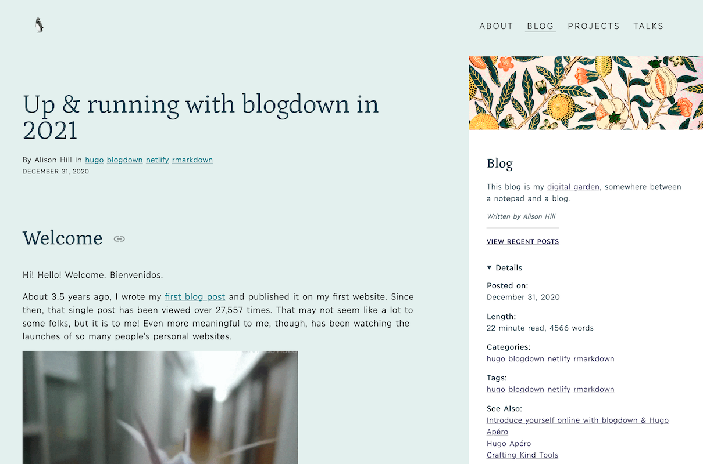
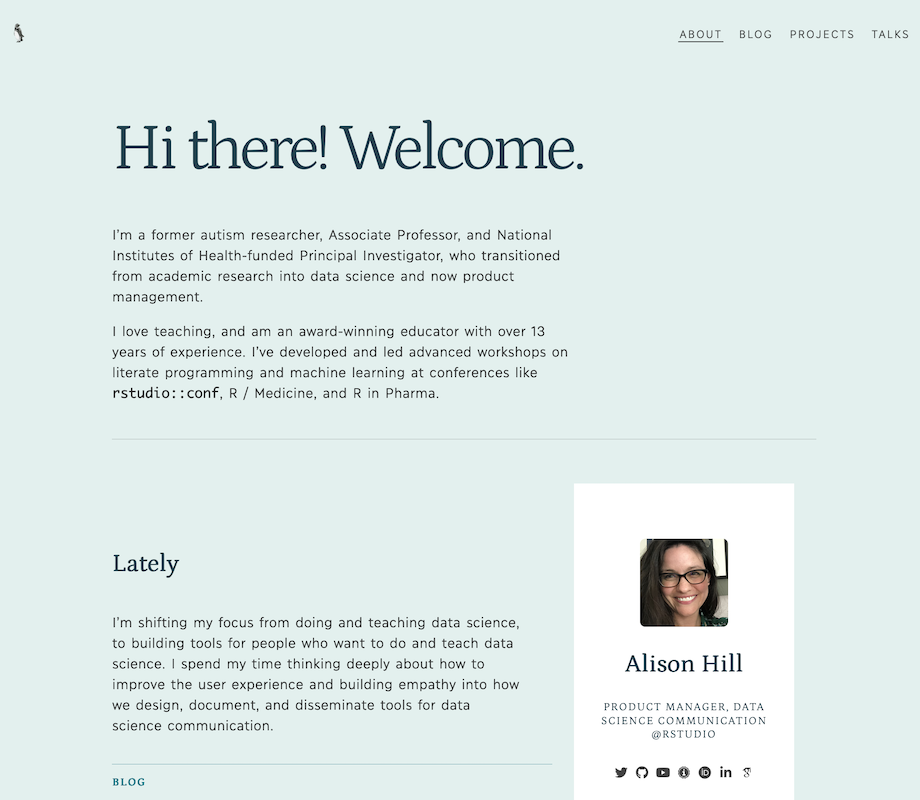

## Single pages in sections

You have two options for where to place front matter for single pages. You can use the front matter of the page like `/blog/my-blog-post/index.md`, or you could use the `cascade` key in the section front matter like `/blog/_index.md`. You can set up the cascade to avoid repeating yourself, if you want to make sure to configure all pages in the same section the same way:

```yaml
# set up common front matter for all pages inside blog/
cascade:
  author: "Alison Hill"
  show_author_byline: true
  show_post_date: true
  show_comments: true # see site config to choose Disqus or Utterances
```

You can still override any of these options in the YAML front matter of an individual page- it will always trump the cascade if present. To learn more about single pages, read the [Hugo docs](https://gohugo.io/templates/single-page-templates/).

In the front matter of a page, along with things you'd expect like title, subtitle, excerpt, and author, there are two choices for `layout`: 

+ `single` or 
+ `single-sidebar`. 

```yaml
layout: single # single or single-sidebar
```














Either of these layouts will work for any content section (blogs, projects, talks), and can even be mixed and matched within any content section. You can also add link buttons to the top of a single page in any content section (helpful for sharing external resources related to a page like a slide deck, YouTube video, GitHub repository, etc.):

```yaml
links:
- icon: door-open # icon name without the 'fa-'
  icon_pack: fas
  name: website
  url: https://allisonhorst.github.io/palmerpenguins/
- icon: github # icon name without the 'fa-'
  icon_pack: fab
  name: code
  url: https://github.com/allisonhorst/palmerpenguins/
- icon: newspaper # icon name without the 'fa-'
  icon_pack: far
  name: Blog post
  url: https://education.rstudio.com/blog/2020/07/palmerpenguins-cran/
```

For each link, pick your `icon` and `icon_pack` from the [Font Awesome](https://fontawesome.com/) [fab / fas / far] or [Academicons](https://jpswalsh.github.io/academicons/) [ai] free icon libraries. 

All external links (i.e., those that start with `http`) will open in a new tab (that is, `target="_blank"`); relative links to pages within the site will open in the same window (links relative to your site root should start with `/`; links relative to the current page should not; to link up from current directory use `../` to go up a level).

### Page sidebar content

When you use the `single-sidebar` layout, the sidebar contents can be controlled by either the page file (`/blog/my-blog-post/index.md`) or the the section page file (`/blog/_index.md`) containing a set of front matter for that section's sidebar. In this file you can specify an image, title, description, author name (good for groups or teams), a text link and a boolean for the ad unit. 

```yaml
# set up common front matter for all pages inside blog/
cascade:
  # for single-sidebar layout
  sidebar:
    text_link_label: View recent talks
    text_link_url: /talk/
    show_sidebar_adunit: false # show ad container
```

By default, the page sidebar will use the section's `sidebar-listing` image if present. To instead use a unique page-specific sidebar image, the image file in that page's bundle with the word `sidebar` in the filename will be used in the sidebar (like `sidebar.jpg` or even `mario-kart-sidebar.png`). 

```bash
content/
└── blog
    ├── _index.md
    ├── sidebar-listing.png
    └── my-blog-post
        ├── my-featured-thumbnail.jpg 
        ├── my-post-sidebar.jpg
        └── index.md
```

If you want the sidebar image to **also** be the thumbnail image on the listing page, add the word `featured` to the filename (like `featured-sidebar.jpg` or even `mario-kart-sidebar-featured.png`). The featured image will also be that page's social sharing image. 

## Homepage

The homepage of your site can be quickly configured:













Fill out the YAML in `/content/_index.md`:

```yaml
---
title: "Alison Hill"
subtitle: "Product Manager, Data Science Communication @RStudio"
description: |
  longish
  text
  here.
images:
  # goes in /static/img
  - img/home.jpeg
image_left: false
text_align_left: true
show_social_links: true # specify social accounts in site config
show_action_link: true
action_link: /about
action_label: "About me &rarr;"
action_type: text # text, button
type: home
---
```

The homepage image goes in the `/static/` folder:

```bash
content/
├── _index.md
└── static/
    └── img/
        └── home.jpeg
```

Read the [full docs here](/learn/homepage/).


## About page

The "about" page of your site can also be quickly configured:














Fill out the YAML front matter in four markdown files:

+ `/content/about/_index.md`,
+ `/content/about/header/index.md` (if you want one),
+ `/content/about/main/index.md` (the wide column), and
+ `/content/about/sidebar/index.md` (the narrow column).

To change which content sections are previewed, use `mainSections` in your `config.toml` file:

```toml
[params]
  mainSections = ["blog", "project", "talk"]
```

For the avatar image, name the image file `avatar` and save in the `/content/about/sidebar/` folder. For the audio file, name it `audio` and save in the same folder:

```bash
content/
├── _index.md
└── about/
    ├── _index.md
    ├── header/index.md
    ├── main/index.md
    └──  sidebar/
        ├── index.md
        ├── avatar.jpg
        └── audio.m4a
```


Read the [full docs here](/learn/about-page/).


## Regular page

A regular page (not a form and not a page in a content section like blogs, projects, or talks) has a few configurations as well. There are two `layout` options: `standard` or `wide-body`, and an option to show the page title as a large headline at the top above the content.

```yaml
layout: standard # standard or wide-body
show_title_as_headline: false
```

## Contact page

This website comes with a Formspree form that's designed to work with a static website. You can edit the one already present in the site content. Here is a preview: https://hugo-apero.netlify.app/contact/

```bash
content/
└── form/
    └── contact.md
```

Your new contact page contains auto-generated front matter that defines the form name, title, date, and url, and more. Most important is the `formspree_form_id` key. You can find this on the integration page which is displayed after you create a new form. It looks like `https://formspree.io/<hashid>`.

You can also specify a description that will display below the title, choose a right or left position for the form itself via `layout`, set a preferred `submit_button_label`, and toggle a few things on or off.

```yaml
description:
layout: split-right # split-right or split-left
submit_button_label: Send
show_social_links: true
show_poweredby_formspree: true
formspree_form_id: <hashid>
```
