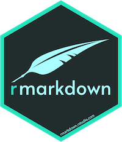
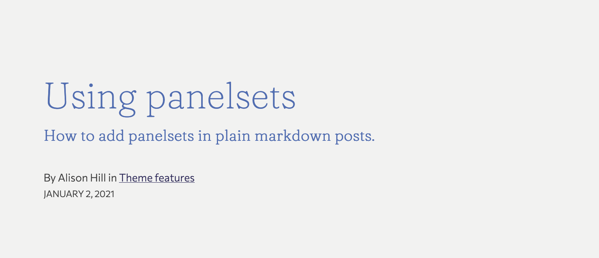
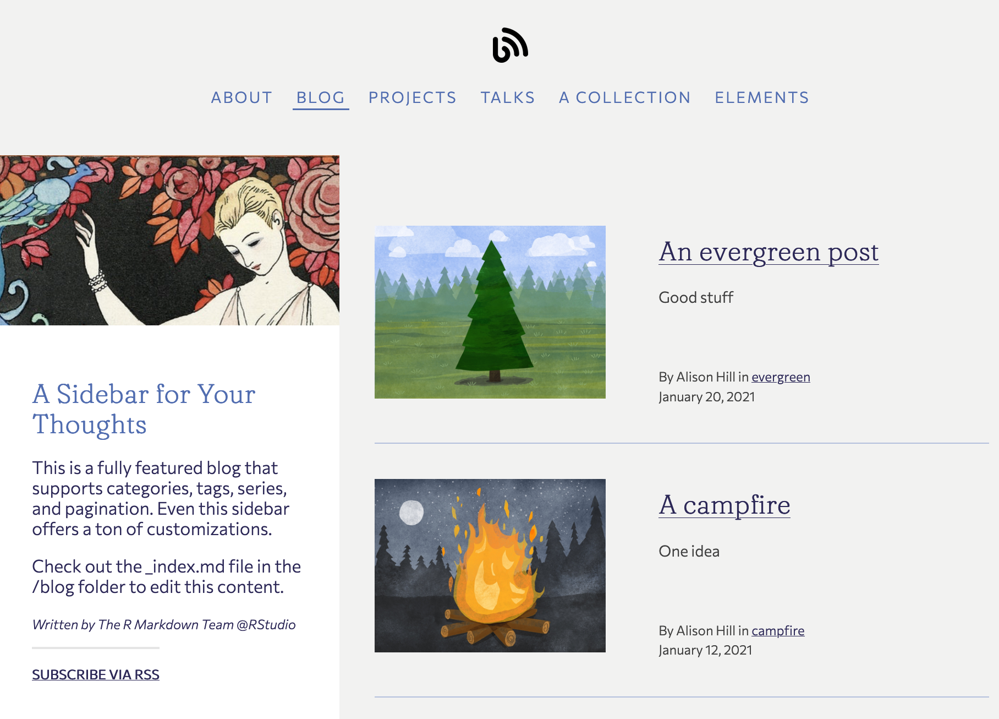
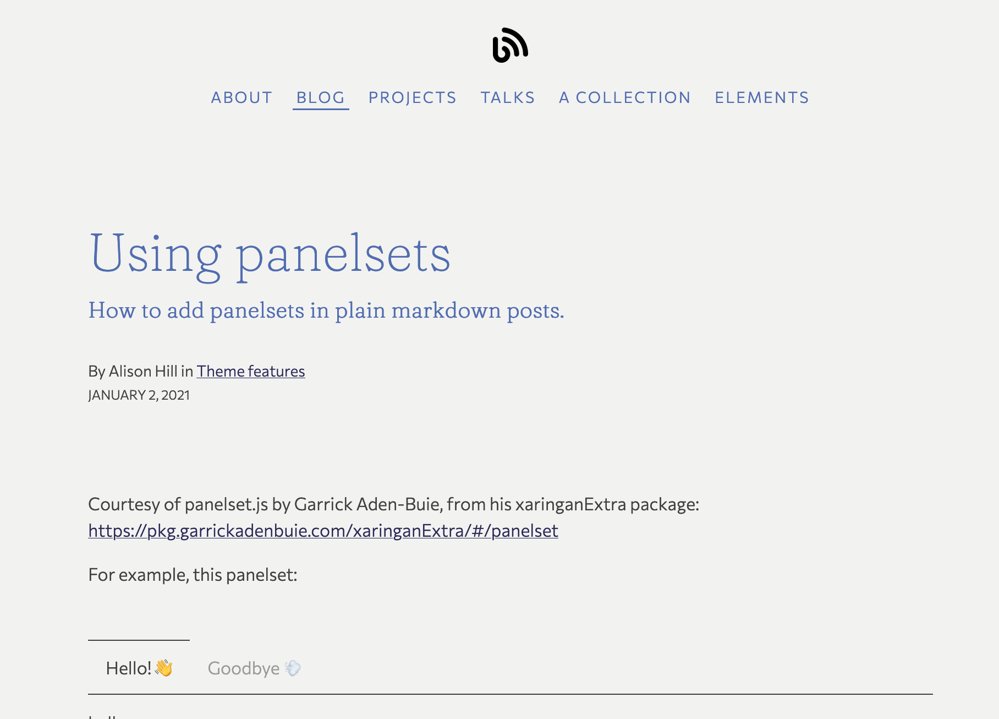

```{r setup, include=FALSE}
options(htmltools.dir.version = FALSE)
knitr::opts_chunk$set(collapse = TRUE,
                      fig.retina = 3)
library(xaringanExtra)
library(magick)
library(purrr)
```


```{r share-again, echo=FALSE}
xaringanExtra::use_share_again()
```

class: title-slide, center, bottom
background-image: url(img/innocents.png)
background-position: 50% 0%
background-size: 60%
background-color: #FEF0EC

# `r rmarkdown::metadata$title`

## `r rmarkdown::metadata$subtitle`

### `r rmarkdown::metadata$author`

---
class: center, bottom
background-image: url(img/internet.jpg)
background-position: 50% 20%
background-size: 30%
background-color: #ffffff

# Why introduce yourself online? 

---
class: center, middle

# Why introduce yourself online? 

--

Fame? 

--

Fortune? 

--

Friendship? 

--

Findability? 

--

Fun?

--

Functional?

---
class: center, middle

# Why introduce yourself online? 


~~Fame~~ `r emo::ji("x")`

~~Fortune~~ `r emo::ji("x")`

Friendship `r emo::ji("heavy_check_mark")`

Findability `r emo::ji("heavy_check_mark")`

Fun `r emo::ji("heavy_check_mark")`

Functional `r emo::ji("heavy_check_mark")`

---
class: inverse, center, middle

# Mood

---
background-image: url(img/mr-rogers.jpg)
background-size: contain
class: bottom, center


<!--https://twitter.com/jlengstorf/status/1334594454347415554?s=20-->

---
class: middle

## How to introduce yourself online?

Lots of ways!

--

Today, we'll use blogdown `r emo::ji("dango")`

---

# But first...

---
class: bottom, center, inverse
background-image: url(img/blogdown.png)
background-position: 50% 20%
background-size: 25%

# Meet blogdown


---

# Meet blogdown

--

An R package...

--

that lets you create websites in RStudio...

--

and use R Markdown...plots, tables, outputs!

???

So what is blogdown?

It is an R package... can I get a show of hands for everyone here who uses R? OK keep them up...

That lets you create websites in RStudio...can I get all of you R users to keep your hand up if you use RStudio, so lower your hand if you don't use RStudio

Perfect, thanks! So this is one of the first perks of blogdown, which is that you can build a website in the RStudio IDE using tools you are familiar with, and you won't need very much else to start.


---
class: inverse, center, middle

# Why R Markdown?

---
class: center, middle

# Why R Markdown?

--

Develop your code and ideas in reproducible documents

--

Knit plots, tables, and results together with narrative text

--

Create analyses ready to be shared

--

Plus: Use RStudio IDE

--

Use the tools you already use (or should be using- `r emo::ji("wink")`) for your work

---
class: inverse, center, middle

## What *is* R Markdown?

---


# What is R Markdown?


1. An authoring framework for data science.

1. A document format (`.Rmd`).

1. An R package named `rmarkdown`.

1. A file format for making dynamic documents with R. 

1. A tool for integrating prose, code, and results.

1. A computational document.

1. Wizardry.


---


# What is R Markdown?

1. ["An authoring framework for data science."](https://rmarkdown.rstudio.com/lesson-1.html) (`r emo::ji("heavy_check_mark")`)

1. [A document format (`.Rmd`).](https://bookdown.org/yihui/rmarkdown/) (`r emo::ji("heavy_check_mark")`)

1. [An R package named `rmarkdown`.](https://rmarkdown.rstudio.com/docs/) (`r emo::ji("heavy_check_mark")`)

1. ["A file format for making dynamic documents with R."](https://rmarkdown.rstudio.com/articles_intro.html) (`r emo::ji("heavy_check_mark")`)

1. ["A tool for integrating text, code, and results."](https://r4ds.had.co.nz/communicate-intro.html) (`r emo::ji("heavy_check_mark")`)

1. ["A computational document."](http://radar.oreilly.com/2011/07/wolframs-computational-documen.html) (`r emo::ji("heavy_check_mark")`)

1. Wizardry. (`r emo::ji("wizard")`)

---
class: center
background-image: url("img/rmd_flowchart.png")
background-size: contain

## What is R Markdown?

---
background-image: url(img/rmarkdown_hedgehog_wide.png)
background-size: contain
background-position: middle, center

---
class: center, middle

.pull-left[

]

.pull-right[

]

.pull-left[

]

.pull-right[

]

---
class: inverse, bottom center
background-image: url(img/gopher-hero.svg)
background-position: 50% 20%
background-size: 25%

# Who is Hugo?

??? 

The package helps you to use a static site generator named Hugo. If you didn't understand much of the last sentence I said, that is OK! The main thing you'll want to know is that Hugo gives you over 100 themes to choose from, so you can create a custom-looking website, in the same way that Wordpress offers website themes.

One difference here is that you own your content, and the entire pipeline for creating it, from start to finish, which I think is a huge benefit to users. You control what, you control when, you control how.

---
class: center, middle

# Why Hugo?

--

Markdown first

--

Content organization (subfolders!)

--

Layouts

--

Multilingual sites

--

Powerful taxonomies

--

Magical [list templates](https://gohugo.io/templates/lists/)

---
class: inverse, center, middle

## What *is* Hugo?

--

`themes/hugo-apero/layouts/`

---
class: middle


```html
<header class="post-header">
  <h1 class="f1 lh-solid measure-narrow mb3 fw4">{{ .Title }}</h1>
  {{ if .Params.subtitle }}
    <h4 class="f4 mt0 mb4 lh-title measure">
    {{ .Params.subtitle }}
    </h4>
  {{ end }}
</header>
```

--




---
class: bottom, center
background-image: url(img/mustache.jpg)
background-size: 25%
background-color: #ffffff


## Hugo = a double curly brace templating system

## `{{ <hugo code goes here> }}`


---
class: middle 

# Use your YAMLs `r emo::ji("sweet_potato")`

AKA "frontmatter"

.pull-left[
```yaml
---
title: "Using panelsets"
subtitle: "How to add panelsets..."
---
```
]

--

.pull-right[
```go

{{ .Title }}
{{ .Params.subtitle }}

```
]


---
class: middle

# Hugo Page Bundles

```
.
├── content/
│   ├── privacy/index.md       # => a leaf bundle
│   └── faves/                 # => a branch bundle
│       ├── _index.md          # => AHA!
│       ├── roses/index.md     # => a leaf bundle
│       ├── kittens/index.md   # => another leaf bundle
│       └── kettles/index.md   # => yet another leaf bundle
```

---
class: middle

# Hugo list vs single templates

.pull-left[

]

--

.pull-right[

]

---
class: middle

# Hugo list vs single templates

```
.
├── content/
│   ├── privacy/index.md       # => single page
│   └── faves/                 
│       ├── _index.md          # => **list all faves**!
│       ├── roses/index.md     # => single page
│       ├── kittens/index.md   # => single page
│       └── kettles/index.md   # => single page
```

---
class: activity, center, middle

# `r emo::ji("stopwatch")`

## To configure your new Hugo site!

`r emo::ji("clock")` 10 minutes

---
background-image: url(img/Whisper.jpg)
background-size: contain

<div class="word-bubble" style="
  position: absolute; 
  text-align: center;
  width: 50%; 
  top: 100px;
  left: 310px;
  font-size: 1.3em;
"> We need a place to put things. </div>


---
background-image: url("img/server.jpg")
background-size: 80%
background-position: bottom
class: center, top
background-color: #ffffff

# Where to put things?


--


???

which is basically a big computer in the clouds

hat/tip to Heather Nolis for that analogy.

--


---
class: inverse, center, middle

# Why Netlify?

---
class: center, middle

# Why Netlify?

--

Continuous deployment

--

Speaks Hugo (but not R)

--

FEATURES (PR deploy previews / branch deploys / rollbacks)

---
class: inverse, middle

> Continuous deployment works by connecting a Git repository to a Netlify site and keeping the two in sync.

> &mdash; [Netlify docs](https://docs.netlify.com/site-deploys/create-deploys/)

---
class: center, middle

# `r emo::ji("megaphone")` Speaks Hugo

---
class: middle, center

```{r echo = FALSE, out.width="80%"}
list_png <- c("img/blogdown-build/Slide1.png",
              "img/blogdown-build/Slide2.png",
              "img/blogdown-build/Slide3.png")

list_png %>% 
  map(image_read) %>% # reads each path file
  image_join() %>% # joins image
  image_scale("2000") %>% 
  image_animate(fps = .5)  # animates, can opt for number of loops
```

---
class: middle, center
```{r echo = FALSE, out.width = "80%"}
list_png <- c("img/blogdown-build/Slide3.png",
              "img/blogdown-build/Slide4.png",
              "img/blogdown-build/Slide5.png")

list_png %>% 
  map(image_read) %>% # reads each path file
  image_join() %>% # joins image
  image_scale("2000") %>% 
  image_animate(fps = .5)  # animates, can opt for number of loops
```

---
class: middle, center

```{r echo = FALSE, out.width = "80%"}
list_png <- c("img/blogdown-build/Slide6.png",
              "img/blogdown-build/Slide7.png",
              "img/blogdown-build/Slide8.png")

list_png %>% 
  map(image_read) %>% # reads each path file
  image_join() %>% # joins image
  image_scale("2000") %>% 
  image_animate(fps = .5)  # animates, can opt for number of loops
```


---
class: inverse, center, middle

# Why Netlify?

Go to this repo:
<https://github.com/apreshill/iyo-apero>

Click on the "Deploy to Netlify" button `r emo::ji("rocket")`

---
class: activity, center, middle

# `r emo::ji("stopwatch")`

## To your new site!

Let's go on a file scavenger hunt.

`r emo::ji("clock")` 10 minutes


---
background-image: url(img/stars.jpg)
background-position: 50% 20%
background-size: 30%
class: inverse, bottom, center

# Why Hugo Apéro?


---
class: middle, center

<blockquote class="twitter-tweet"><p lang="en" dir="ltr">Build a website with HTML and CSS that somebody else wrote. <a href="https://t.co/ya2NWe2rff">https://t.co/ya2NWe2rff</a></p>&mdash; Alison Presmanes Hill (@apreshill) <a href="https://twitter.com/apreshill/status/1280635175538311168?ref_src=twsrc%5Etfw">July 7, 2020</a></blockquote> <script async src="https://platform.twitter.com/widgets.js" charset="utf-8"></script> 


---
class: bottom, center
background-image: url(img/goodnight-site.jpg)
background-position: 50% 20%
background-size: 50%
background-color: #ffffff

# Why blogdown?

---
class: center, middle

# Why blogdown?

--

R!

--

Checking functions `r emo::ji("heavy_check_mark")`

--

Hugo versioning system

--

`.Rprofile` for custom experience 

---
class: activity, center, middle

# `r emo::ji("stopwatch")`

## To your site!

Run checks, or add/edit content.

`r emo::ji("clock")` 10 minutes

---
class: center, bottom
background-image: url(img/question.jpg)
background-position: 50% 10%
background-size: 40%
background-color: #ffffff

# "Must I blog?"

--

No. 

--

But you can. And if you do, you may follow your own rules. It is *your* space.


---
class: inverse, center, middle

# Why blog?


---
class: center, middle

## Of digital streams, campfires, and gardens

<https://tomcritchlow.com/2018/10/10/of-gardens-and-wikis/>

## The garden and the stream, a technopastoral

<https://hapgood.us/2015/10/17/the-garden-and-the-stream-a-technopastoral/>

---
background-image: url(img/river.jpg)
background-position: right
background-size: contain
class: middle
name: stream

---
template: stream

.pull-left[
# Streams
]

---
template: stream

.pull-left[

> You don’t experience the Stream by walking around it and looking at it, or following it to its end. You jump in and let it flow past. You feel the force of it hit you as things float by.

> It’s not that you are passive in the Stream. You can be active. But your actions in there — your blog posts, @ mentions, forum comments — exist in a context that is collapsed down to a simple timeline of events that together form a narrative.

> &mdash; Mike Caulfield
]

---
template: stream

.pull-left[

> Streams - mostly Twitter for me, this is where fast twitch information discovery happens. The firehose of content. But with an undercurrent of creating new connections.

> &mdash; Tom Critchlow
]

---
name: campfire
background-image: url(img/campfire.jpg)
background-position: right
background-size: 50%
class: middle

---
template: campfire

.pull-left[
# Campfires
]

---
template: campfire

.pull-left[

> "Campfires - mostly blogging for me, though I know some folks gather around private slack groups too. My blog functions as a digital campfire (or a series of campfires) that are slower burn but fade relatively quickly over the timeframe of years. 

> Connection forming, thinking out loud, self referencing and connection forming. This builds muscle, helps me articulate my thinking and is the connective tissue between ideas, people and more."

> &mdash; Tom Critchlow
]

---
name: garden
background-image: url(img/garden.jpg)
background-position: right
background-size: contain
class: middle
background-color: #f2f0ef


---
template: garden

.pull-left[
# Gardens
]

---
template: garden

.pull-left[

> Every walk through the garden creates new paths, new meanings, and when we add things to the garden we add them in a way that allows many future, unpredicted relationships.

> &mdash; Mike Caulfield
]

---
background-image: url(img/garden-main.png)
background-position: center middle
background-size: 30%
class: bottom, center
background-color: #ffffff

## A Brief History & Ethos of the Digital Garden

<https://maggieappleton.com/garden-history>


---
template: garden

.pull-left[

> Gardens are by nature non-homogenous. No two gardens are alike. Even if you plant the same plants as your neighbours, you plant them in a different arrangement.

> The point of the garden is that's it's a personal playspace. You organise the garden around the ideas and mediums that are particular to you.

> A large part of gardening is claiming a small patch of the web for yourself, one you fully own and control.

> &mdash; Maggie Appleton

]

---
background-image: url(img/digital-garden.png)
background-position: center middle
background-size: 70%
class: bottom, center
background-color: #ffffff


<https://maggieappleton.com/garden-history>

---
background-image: url(img/seedling.jpg)
background-position: right
background-size: 50%
class: middle
background-color: #ffffff

.pull-left[

> Level of effort put into them. 

> Degree of coherence and readability. 

> Seedlings > Evergreen

> &mdash; Maggie Appleton

]

---
background-image: url(img/evergreen.jpg)
background-position: right
background-size: 50%
class: middle
background-color: #ffffff

.pull-left[
> Level of effort put into them. 

> Degree of coherence and readability. 

> Seedlings > Evergreen

> &mdash; Maggie Appleton
]


---
class: activity, center, middle

# `r emo::ji("stopwatch")`

## To GitHub.com!

Let’s go to our breakout rooms and make our GitHub name tags right now

`r emo::ji("clock")` 10 minutes
